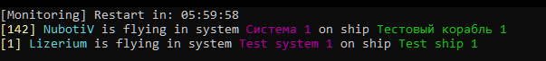

<h1 align="center">Lizerium Restarter Server</h1>

<p align="center">
  
  
  
  
</p>

<p align="center">
  <b>Automatic monitoring</b>, restart and remote API control for Freelancer game servers
</p>

<div align="center" style="margin: 20px 0; padding: 10px; background: #1c1917; border-radius: 10px;">
  <strong>🌐 Language: </strong>
  
  <a href="README.ru.md" style="color: #F5F752; margin: 0 10px;">
    🇷🇺 Russian
  </a>
  | 
  <span style="color: #0891b2; margin: 0 10px;">
    ✅ 🇺🇸 English (current)
  </span>
</div>

---

> [!NOTE]
> This project is part of the **Lizerium** ecosystem and belongs to the following project:
>
> - [`Lizerium.Software.Structs`](https://github.com/Lizerium/Lizerium.Software.Structs)
>
> If you're looking for related engineering and support tools, start there.

## Features

- Automatic restart if server process stops
- Restart when no players online for configured time
- Live player board in console
- Mini HTTP API for bots / websites
- Multilingual interface (English / Russian)
- JSON configuration
- Lightweight standalone .NET 8 utility

## Console Preview



## Api

### Local


### Global


## Quick Start

```bash
dotnet build -c Release
```

Run:

```bash
Lizerium.Restarter.Server.exe
```

## Configuration

Edit:

```text
appsettings.json
```

Example:

```json
{
	"StatsFilePath": "stats.json",
	"ServerExecutablePath": "flserver.exe",
	"RestartIfNoPlayersAfterMinutes": 60,
	"CheckIntervalSeconds": 5,
	"ApiPort": 52349,
	"Language": "En"
}
```

## Languages

Supported UI languages:

- English
- Russian

Switch language:

```json
"Language": "Ru"
```

## Documentation

- [BUILD.md](docs/BUILD.md)
- [DEPLOY_WINDOWS.md](docs/DEPLOY_WINDOWS.md)
- [API.md](docs/API.md)

## Tech Stack

- .NET 8
- Kestrel
- JSON API
- Windows Server Ready

## License

MIT
