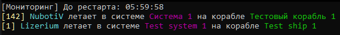
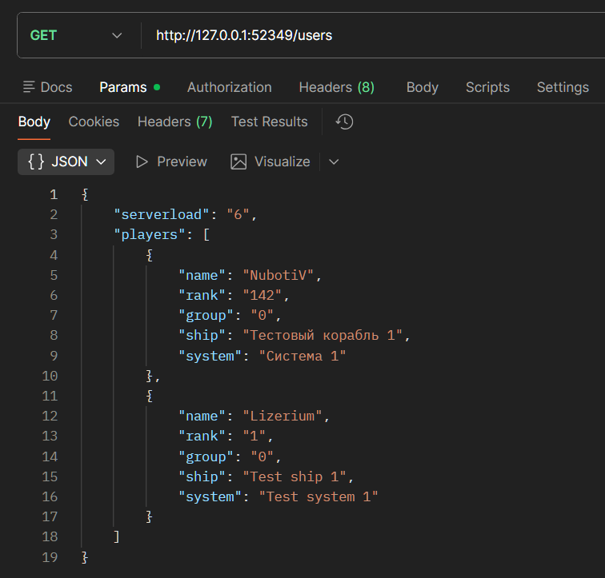
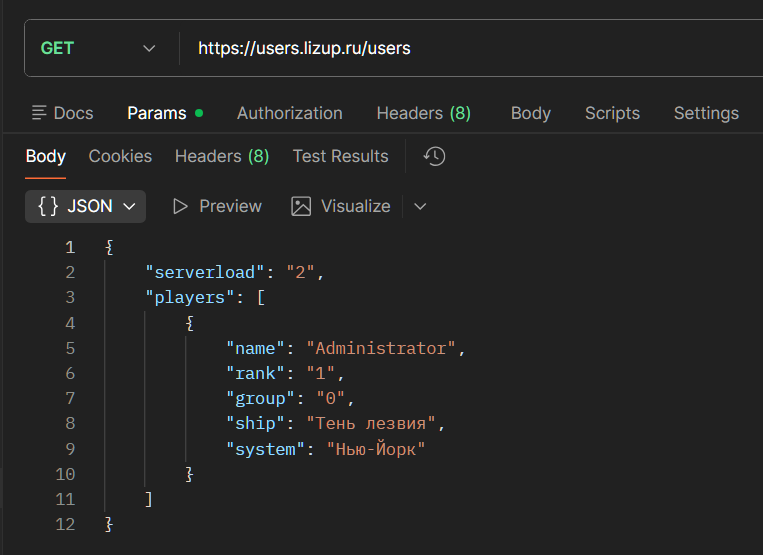

<h1 align="center">Lizerium Restarter Server</h1>

<p align="center">
  
  
  
  
</p>

<p align="center">
  <b>Автоматический мониторинг</b>, перезапуск и удалённое API-управление игровыми серверами Freelancer.
</p>

<div align="center" style="margin: 20px 0; padding: 10px; background: #1c1917; border-radius: 10px;">
  <strong>🌐 Язык: </strong>
  
  <span style="color: #F5F752; margin: 0 10px;">
    ✅ 🇷🇺 Русский (текущий)
  </span>
  | 
  <a href="README.md" style="color: #0891b2; margin: 0 10px;">
    🇺🇸 English
  </a>
</div>

---

> [!NOTE]
> Этот проект является частью экосистемы **Lizerium** и относится к направлению:
>
> - [`Lizerium.Software.Structs`](https://github.com/Lizerium/Lizerium.Software.Structs)
>
> Если вы ищете связанные инженерные и вспомогательные инструменты, начните оттуда.

## Возможности

- Автоматический перезапуск при остановке процесса сервера
- Перезапуск при отсутствии игроков заданное время
- Живая таблица игроков в консоли
- Мини HTTP API для ботов / сайтов / мониторинга
- Мультиязычный интерфейс (Русский / English)
- JSON конфигурация
- Лёгкая standalone утилита на .NET 8

## Предпросмотр консоли



## API

### Локально



### Глобально



## Быстрый старт

```bash id="x8q3tm"
dotnet build -c Release
```

Запуск:

```bash id="z6m1pt"
Lizerium.Restarter.Server.exe
```

## Конфигурация

Отредактируйте:

```text id="k2n8va"
appsettings.json
```

Пример:

```json id="u5v2xh"
{
	"StatsFilePath": "stats.json",
	"ServerExecutablePath": "flserver.exe",
	"RestartIfNoPlayersAfterMinutes": 60,
	"CheckIntervalSeconds": 5,
	"ApiPort": 52349,
	"Language": "Ru"
}
```

## Языки интерфейса

Поддерживаются:

- Русский
- English

Смена языка:

```json id="f7m0zy"
"Language": "En"
```

## Документация

- [BUILD.md](docs/BUILD.md)
- [DEPLOY_WINDOWS.md](docs/DEPLOY_WINDOWS.md)
- [API.md](docs/API.md)

## Технологии

- .NET 8
- Kestrel
- JSON API
- Подготовлено для Windows Server

## Лицензия

MIT
